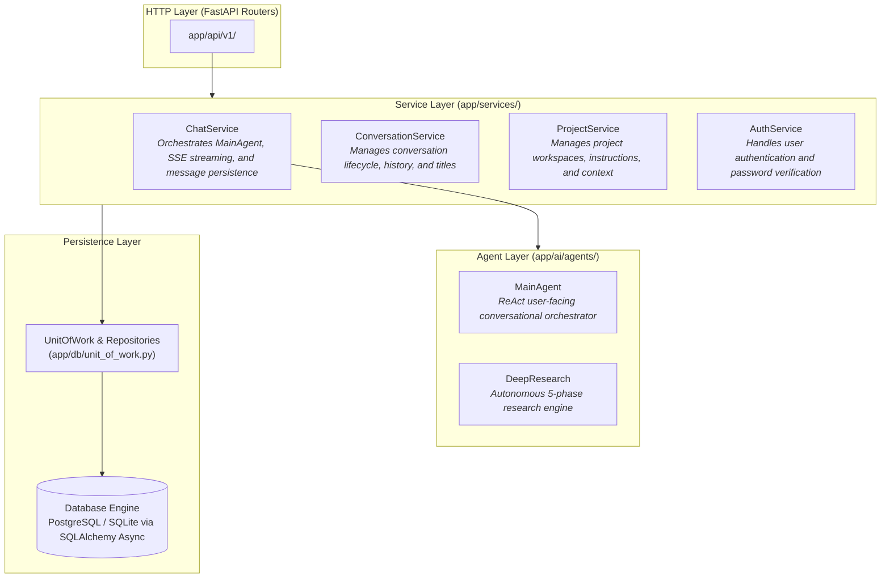

```mermaid
flowchart TD
    subgraph HTTP["HTTP Layer (FastAPI Routers)"]
        HTTPRouters["app/api/v1/"]
    end

    subgraph Services["Service Layer (app/services/)"]
        ChatService["ChatService<br/><i>Orchestrates MainAgent, SSE streaming, and message persistence</i>"]
        ConversationService["ConversationService<br/><i>Manages conversation lifecycle, history, and titles</i>"]
        ProjectService["ProjectService<br/><i>Manages project workspaces, instructions, and context</i>"]
        AuthService["AuthService<br/><i>Handles user authentication and password verification</i>"]
    end

    subgraph Agents["Agent Layer (app/ai/agents/)"]
        MainAgent["MainAgent<br/><i>ReAct user-facing conversational orchestrator</i>"]
        DeepResearch["DeepResearch<br/><i>Autonomous 5-phase research engine</i>"]
    end

    subgraph DataAccess["Persistence Layer"]
        UOW["UnitOfWork & Repositories<br/>(app/db/unit_of_work.py)"]
        DB[("Database Engine<br/>PostgreSQL / SQLite via SQLAlchemy Async")]
    end

    %% Flow connections
    HTTPRouters --> Services
    ChatService --> Agents
    Services --> UOW
    UOW --> DB
```