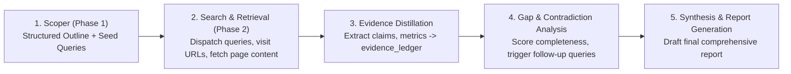

```mermaid
flowchart LR
    Scoper["1. Scoper (Phase 1)\nStructured Outline + Seed Queries"]
    --> Search["2. Search & Retrieval (Phase 2)\nDispatch queries, visit URLs, fetch page content"]
    --> Distill["3. Evidence Distillation\nExtract claims, metrics -> evidence_ledger"]
    --> Critique["4. Gap & Contradiction Analysis\nScore completeness, trigger follow-up queries"]
    --> Synthesize["5. Synthesis & Report Generation\nDraft final comprehensive report"]
```
