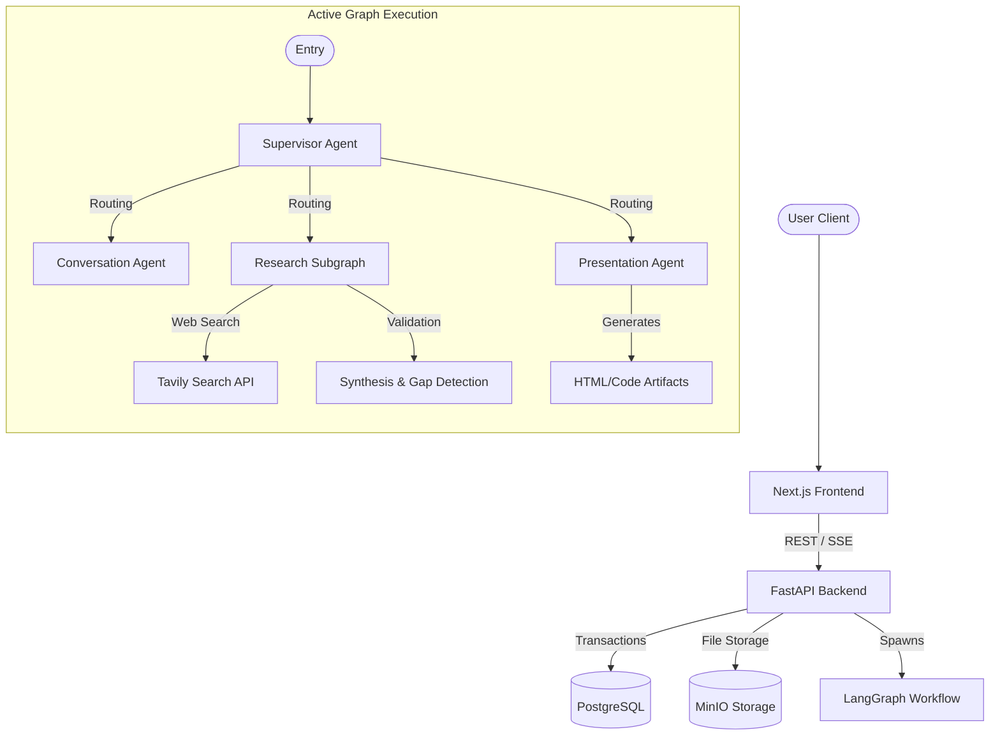

# BravousAI: Comprehensive Project Architecture & Context

This documentation serves as the ultimate source of truth for the BravousAI multi-agent application. It outlines the end-to-end architecture, backend infrastructure, frontend layout, AI graph orchestration, and the specialized nodes, tools, and services that drive the platform.

---

## 1. High-Level System Architecture

BravousAI is a complex full-stack web application designed to act as an intelligent autonomous agent capable of deep research, chat interaction, and dynamic artifact generation.

- **Frontend**: A highly interactive Next.js (App Router) React application. It manages project contexts, streaming server-sent events (SSE) from the backend, and renders complex modular UI components (like markdown parsing, interactive data charts, mermaid diagrams, and live artifact preview iframes).
- **Backend API**: A FastAPI backend providing robust REST and Streaming endpoints.
- **AI Agent Graph**: Powered by **LangChain** and **LangGraph**, it compiles a stateful, resilient multi-agent workflow. Independent agents (Supervisor, Conversation, Researcher, Presentation) operate on a shared `AgentState` context, saving checkpoints to a PostgreSQL database via a Unit of Work pattern.
- **Database**: PostgreSQL (with SQLAlchemy and async Psycopg) utilizing Alembic for schema migrations.
- **Object Storage**: MinIO for managing file uploads, artifact persistence, and unstructured project context data.



---

## 2. Complete Folder & File Structure

The monorepo is divided into the Python backend (`app/`) and the React frontend (`frontend/`).

### 2.1 Backend (`app/`)
```text
app/
├── main.py                     # FastAPI application entrypoint and middleware setup
├── ai/                         # LangGraph Multi-Agent Architecture
│   ├── graph.py                # Graph compilation, checkpointing, and workflow execution
│   ├── nodes/                  # LangGraph Node implementations (Agents)
│   ├── prompts/                # System prompts (Markdown & YAML)
│   ├── skills/                 # Specialized agent skills (e.g., frontend_design/SKILL.md)
│   ├── states/                 # TypedDict and Pydantic schema states for graph memory
│   └── tools/                  # LangChain tools (Web Search, Tavily Extract, Build Artifact)
├── api/                        # FastAPI Route Handlers
│   ├── middleware.py           # Custom middlewares (CORS, Rate Limiting)
│   └── v1/                     # API routes (auth, chat, project, files, artifacts)
├── core/                       # Core App Configurations
│   ├── config.py               # Pydantic BaseSettings for environment variables
│   ├── llm_provider.py         # LLM instantiation (OpenAI/Anthropic wrappers)
│   ├── security.py             # JWT token hashing and validation
│   └── callbacks/              # Tracing and logging handlers
├── db/                         # Database Configuration & Migrations
│   ├── engine.py               # AsyncEngine and AsyncConnectionPool
│   ├── unit_of_work.py         # Transaction boundary manager
│   └── migrations/             # Alembic migration scripts
├── domain/                     # Domain Layer (Entities & Schemas)
│   ├── entities.py             # SQLAlchemy declarative ORM models
│   ├── repositories/           # Data access layer for each entity
│   └── schemas/                # Pydantic models for validation (agents, requests, responses)
├── services/                   # Business Logic Layer
│   ├── chat_service.py         # Orchestrates user chats and graph triggering
│   ├── artifact_service.py     # Manages artifact versioning and rendering
│   ├── workflow_service.py     # Invokes LangGraph workflows
│   ├── object_storage_service.py # Boto3 integration with MinIO for file storage
│   ├── visual_generator_service.py # Generates Mermaid, SVG, HTML cards, and data charts
│   ├── report_composer_service.py # Formats final answer aggregating synthesis and visuals
│   └── ...                     # Context, ProjectFile, Memory, AgentTrace, Auth services
└── utils/                      # Helper Functions & Pipelines
    ├── logging.py              # Application structured logging
    ├── presentation/           # Artifact validation (preventing dangerous JS)
    └── research/               # Deep research normalization, safety, and source extraction
```

### 2.2 Frontend (`frontend/`)
```text
frontend/
├── package.json, next.config.mjs, tsconfig.json
├── app/                        # Next.js App Router Pages
│   ├── layout.tsx & globals.css# Global styling and layouts
│   ├── page.tsx                # Root redirect
│   ├── c/[chatId]/             # Standalone chat interface
│   └── project/[id]/           # Project-scoped chat and context interface
├── components/                 # React UI Components
│   ├── chat-shell.tsx          # Main shell for routing, state, and split-screen UI
│   ├── signin.tsx, signup.tsx  # Authentication modals
│   └── chat/                   # Core Chat UI Elements
│       ├── chat-composer.tsx   # Text input, modes, and submit handlers
│       ├── message-list.tsx    # Renders the message history and active agent traces
│       ├── project-context-panel.tsx # Right-side panel for project files and instructions
│       ├── workflow-trace-card.tsx   # Expandable UI showing agent reasoning and steps
│       └── renderers/          # Specialized content renderers (Mermaid, DataCharts, HTML)
└── lib/                        # Client Utilities
    └── api.ts                  # Fetch wrappers, SSE streaming handlers, and TS types
```

---

## 3. Backend Implementation Details

### 3.1 AI Graph, Nodes, and States (`app/ai/`)
The AI system is a state machine routing between specialized agents.

**States (`app/ai/states/` & `app/domain/schemas/agents_schemas/`)**:
- `chat_state.py`: Defines the `AgentState` object containing `user_query`, `messages`, `workflow_plan`, `clarification`, `research`, and `presentation` dicts.
- Includes modular agent schemas like `visual_schema.py`, `research_package_schema.py`, and `source_extraction_schema.py`.

**Nodes (`app/ai/nodes/`)**:
1. `supervisr.py`: The routing brain. Classifies the user's intent and builds an execution path array (e.g., `["researcher", "presentation", END]`).
2. `conversation.py`: Handles normal conversational queries and implements `interrupt` logic to ask the user clarifying questions via the UI.
3. `research_subgraph.py`: A modular, checkpoint-safe 4-node pipeline replacing monolithic research. It uses the parent graph's checkpointing to ensure interruptions don't force restarts. Nodes include:
   - **Planner**: Generates target queries based on user intent.
   - **Search Executor**: Parallelizes searches via `web_search_tool.py`.
   - **Enricher**: Extracts webpage content with `tavily_extract_tool.py` and custom fallback fetchers.
   - **Synthesizer**: Evaluates evidence using the 5-step validation pipeline.
4. `presentation.py`: Drafts the final response, delegating complex outputs to tools like `build_artifact_tool.py`.

**Tools & Skills (`app/ai/tools/` & `app/ai/skills/`)**:
- Tools wrap external APIs (Tavily) into LangChain tool specifications.
- `SKILL.md` acts as a deep systemic prompt guiding the Presentation node to write beautiful, modern code artifacts.

### 3.2 Services & Business Logic (`app/services/`)
- `ServiceFactory`: Dependency injection container providing all services inside endpoints.
- `WorkflowService`: Wraps the raw LangGraph `CompiledGraph` to execute streams (`astream_events`) and handles state persisting.
- `PresentationArtifactService`: Handles the generation, sanitization (removing dangerous JS APIs like `eval`), and saving of `ChatArtifact` entities to the database.
- `ChatService`: Spawns concurrent tasks (like Title Generation) while executing the GraphRunner and translating graph events into SSE chunks for the frontend.
- `ObjectStorageService`: Integrates with MinIO using `boto3` to manage object storage seamlessly.
- `VisualGeneratorService`: Identifies heuristic contexts to auto-generate visualizations like Mermaid graphs, SVGs, interactive Data Charts, and HTML cards.
- `ReportComposerService`: Integrates standard final text and visually generated blocks into a comprehensive response representation.

### 3.3 Database, Repositories, & Entities (`app/db/` & `app/domain/`)
- `UnitOfWork` (`app/db/unit_of_work.py`): Guarantees transactional atomicity. Exposes all repositories (`uow.users`, `uow.conversations`, `uow.artifacts`, etc.). Rolls back automatically on exception.
- `Entities` (`app/domain/entities.py`): SQLAlchemy models including User, Project, Conversation, Message, WorkflowRecord, ResearchTrace, and Artifacts.

### 3.4 Research Utilities (`app/utils/research/`)
A custom 5-step data validation pipeline:
1. **Source Authority Scoring**: Rates TLDs (`.gov`, `.edu`).
2. **Temporal Freshness**: Detects stale news (older than 2-5 years).
3. **Cross-Source Corroboration**: Checks if multiple domains agree.
4. **Contradiction Detection**: Semantic analysis to find conflicting evidence.
5. **Gap Escalation**: Triggers automated follow-up searches if facts are weak.

---

## 4. Frontend Implementation Details

### 4.1 Client Architecture
- Built on **React 18+** and **Next.js 14 App Router**.
- **`app/globals.css`**: Defines all CSS variables, complex modern component styles (like the dark theme artifact panels, resize handlers, and landing pages), and Tailwind-like utility classes without Tailwind dependency.
- **`lib/api.ts`**: A robust client managing Authentication, Project CRUD, and SSE (Server-Sent Events) streaming to incrementally build the UI as the AI thinks.

### 4.2 Core Components (`frontend/components/chat/`)
- **`chat-shell.tsx`**: The main application controller. It manages the dual-pane layout, maintaining a dynamic `artifactWidth` via a draggable `resize-handle`, and handles complex state like active project injection, auth context, and modal popups.
- **`message-list.tsx`**: Renders User queries and AI responses. Handles streaming artifacts and injecting the expandable agent traces.
- **`workflow-trace-card.tsx`**: A bespoke component that reads the `InFlightWorkflowTrace` to show a beautiful step-by-step breakdown of exactly what the LangGraph is doing (Searching, Synthesizing, Planning). It dynamically renders modern, dark-themed "Artifact Snippet Buttons" inside the chat.
- **`project-context-panel.tsx`**: Provides users a space to upload files and set rigid system instructions for a specific project workspace.
- **`renderers/`**: Safely renders markdown code blocks. For example, `HtmlCardRenderer.tsx` and `InlineVisualRenderer.tsx` inject custom visual capabilities directly into the chat stream.

---

## 5. End-to-End Execution Trace

How a query flows through the system:
1. User types "Build me a React clock" in `chat-composer.tsx`.
2. Frontend calls `/api/v1/chat/stream` using the SSE fetch wrapper in `api.ts`.
3. FastAPI endpoint injects `ChatService`, which builds the initial `AgentState`.
4. `WorkflowService` triggers the LangGraph.
5. **Supervisor Node** sees the intent, routes to **Presentation Node**.
6. **Presentation Node** utilizes `build_artifact_tool.py`, reads `SKILL.md`, and generates React code.
7. `PresentationArtifactService` sanitizes the code, saving an `Artifact` record to PostgreSQL via `UnitOfWork`.
8. The Graph yields `artifact_persisted` events back to the FastAPI stream.
9. Frontend receives the event, `workflow-trace-card.tsx` detects the artifact, and renders the modern dark-themed "Code • TSX" snippet button.
10. User clicks the button; `chat-shell.tsx` activates the split-screen view, rendering the live clock in a sandboxed `iframe` inside the dark-themed `artifact-panel`.
